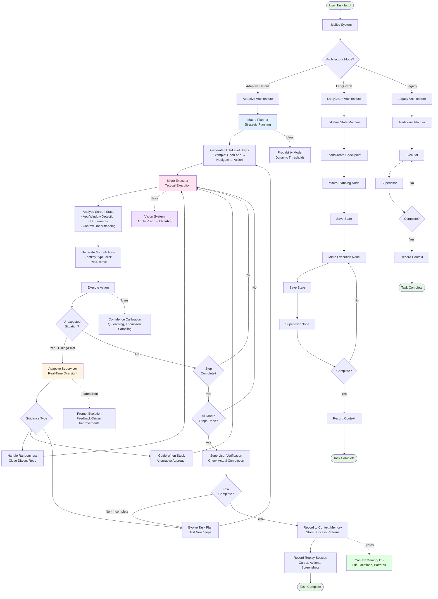
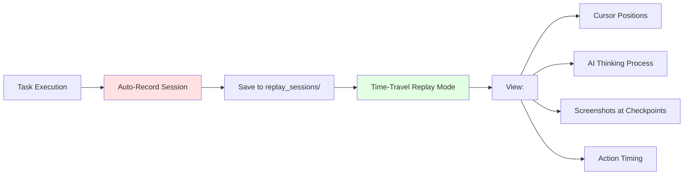
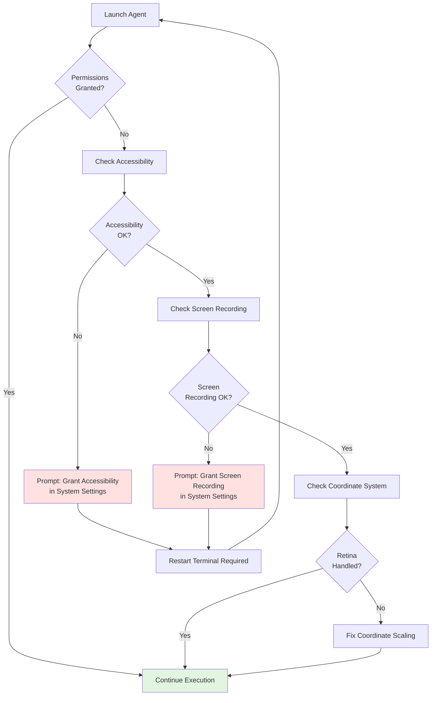

# Houdini Agent Workflow Flowchart

## Complete System Flow



## Component Details

### 1. Macro Planner (Strategic Layer)
- **Input**: User task description
- **Processing**: 
  - Analyzes task complexity using Probability Model
  - Breaks down into high-level steps
  - Does NOT specify keyboard shortcuts
- **Output**: Sequential macro steps (e.g., "Open App", "Navigate to Section")

### 2. Micro Executor (Tactical Layer)
- **Input**: One macro step + current screen state
- **Processing**:
  - Captures screenshot
  - Analyzes UI using Vision System
  - Determines specific actions needed
  - Generates low-level commands
- **Output**: Executable actions (hotkey, type, click, wait)
- **Intelligence**: 
  - Knows when stuck
  - Requests supervisor help
  - Adapts to UI changes

### 3. Adaptive Supervisor (Oversight Layer)
- **Monitors**: Executor progress continuously
- **Handles**:
  - Unexpected dialogs/popups
  - Execution failures
  - Task completion verification
- **Powers**:
  - Can guide executor with alternative approaches
  - Can evolve the macro plan in real-time
  - Can add new steps dynamically
- **Learning**: Feeds back to Prompt Evolution system

### 4. Supporting Systems

#### Vision System
- **Apple Vision Framework**: Hardware-accelerated UI detection
- **UI-TARS MLX**: Semantic grounding for complex elements
- **Coordinate Handling**: Retina display support

#### Probability Model
- **Dynamic Thresholds**: Adjusts match probability based on task
- **Incomplete Specs**: Handles 80-90% info tasks
- **Confidence Scoring**: Q-Learning, Thompson Sampling, Conformal Prediction

#### Context Memory
- **Stores**: Successful file operations, patterns, locations
- **Recalls**: For future task execution
- **Database**: `data/context_memory/`

#### Prompt Evolution
- **Tracks**: Success/failure rates
- **Analyzes**: Error patterns
- **Evolves**: Prompt files automatically when failure rate > 20%

## Execution Modes Comparison

| Feature | Adaptive | LangGraph | Legacy |
|---------|----------|-----------|--------|
| Macro/Micro Separation | ✅ Yes | ✅ Yes | ❌ No |
| Real-Time Evolution | ✅ Yes | ✅ Yes | ⚠️ Limited |
| Checkpointing | ❌ No | ✅ Yes | ❌ No |
| Crash Recovery | ❌ No | ✅ Yes | ❌ No |
| Human-in-Loop | ⚠️ Manual | ✅ Built-in | ❌ No |
| Randomness Handling | ✅ Supervisor | ✅ Supervisor | ⚠️ Basic |
| State Management | 🔄 Dynamic | 🔄 LangGraph | 📝 Sequential |

## Replay & Debugging Flow



## Permission Check Flow



## Quick Reference

### Starting a Task
```bash
python -m src.main --task "your task here"
```

### Architecture Selection
```bash
# Adaptive (default)
python -m src.main --task "task"

# LangGraph with checkpoints
python -m src.main --task "task" --langgraph --checkpoint-path data/checkpoints.db

# Legacy
python -m src.main --task "task" --legacy
```

### Replay Debugging
```bash
# Interactive replay mode
python -m src.main --replay

# List all sessions
python -m src.main --replay-list

# Replay specific session
python -m src.main --replay-session <task_id>
```

### Permission Testing
```bash
python test_permissions.py
```

## Key Innovation: Real-Time Task Evolution

Unlike traditional agents that fail when the plan doesn't match reality, Houdini can **evolve the task mid-execution**:

1. **Initial Plan**: [A] → [B] → [C]
2. **Supervisor Verifies**: Task incomplete after [C]
3. **Evolved Plan**: [A] → [B] → [C] → [D] → [E]
4. **Execution Continues**: Agent completes [D] and [E] automatically

This enables robust handling of:
- Multi-step workflows with dependencies
- Unexpected UI states
- Incomplete task specifications
- Dynamic web content
- Permission dialogs
- App-specific behaviors
